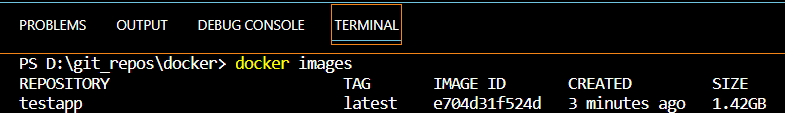

### Simple Process to dockerize flask ml apps

Test App: simple flask app to predict salary of an employee.


### Installation

To run the app, make sure to include the defined dependencies.
```bash
pip install -r requirements.txt
```

### Start the Server
```bash
python run app.py
```

### Dockerize the app
To download Docker [click here](https://www.docker.com/products/docker-desktop/)

<br>1. Create a Dockerfile (make sure you have docker installed)<br>
In your code base create a file named "Dockerfile"
```bash
FROM python:3.11
COPY . .
RUN pip install -r requirements.txt
EXPOSE 80
CMD ["flask", "run", "--host=0.0.0.0", "--port=80"]
```

<br>2. Create an image (make sure you are in your project directory)<br>
Write the below command on terminal
```bash
docker build -t testapp . 
```

<br>3. Check the newly built image
```bash
docker images
```


<br>4. Run the container
```bash
docker run -p 80:80 testapp
```

<br>5. Push the image to docker hub 
1. first, tag the image according to the naming convention<br>
```bash
docker tag testapp YOUR-USER-NAME/testapp
```

<br>2. Now, push it to docker hub

```bash
docker push YOUR-USER-NAME/testapp
```